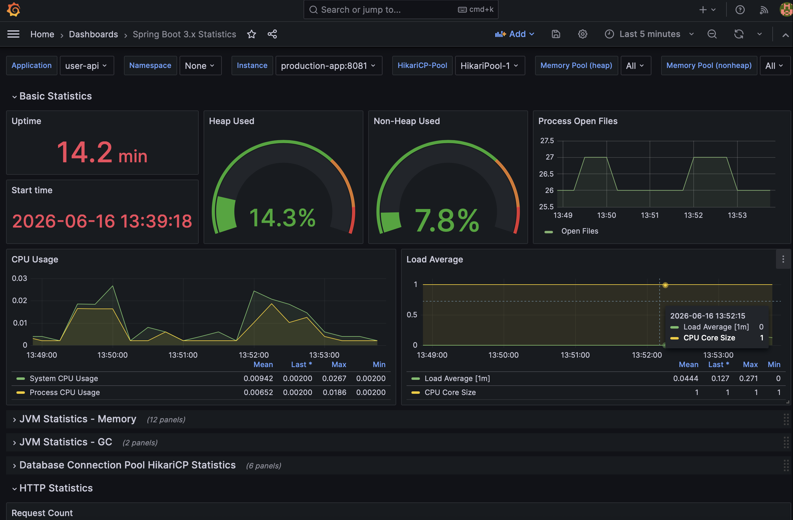
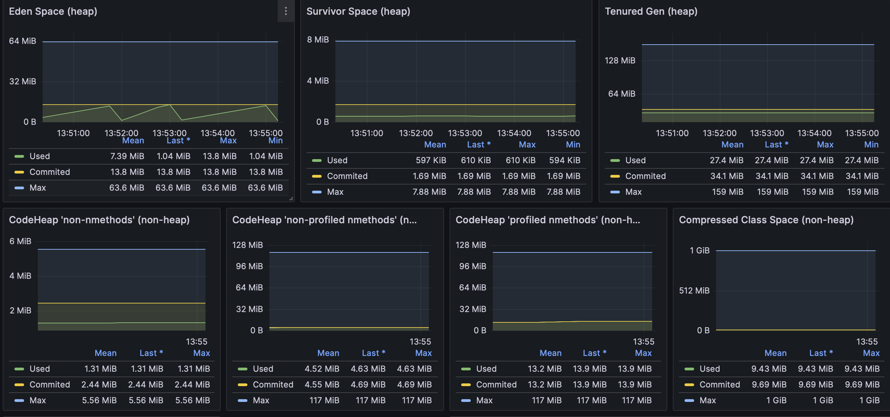
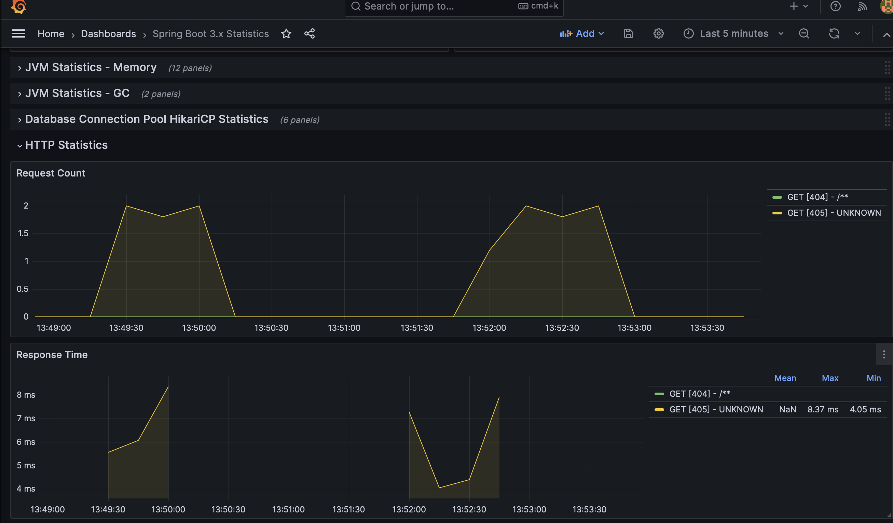
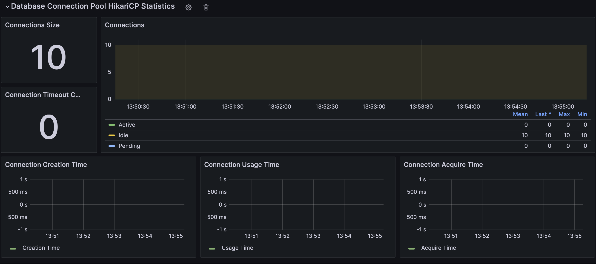

<div align="center">

# 🛡️ Production-Hardened DevSecOps Lifecycle Pipeline

### Ephemeral Multi-Stage Automated Security Pipeline & Cloud Observability Engine

[](https://github.com/aadieng100/devsecops_project01/actions)
[](https://spring.io/projects/spring-boot)
[](https://www.terraform.io/)
[](https://aws.amazon.com/)
[](https://www.zaproxy.org/)
[](LICENSE)

---

*Every Pull Request spins up a brand-new AWS cloud environment, subjects it to five distinct security gates, captures live telemetry, then destroys every resource — maintaining a strict **$0 baseline** operational footprint.*

</div>

---

## 📋 Table of Contents

- [Overview](#-overview)
- [Pipeline Architecture](#-pipeline-architecture)
- [Security Gates](#-enterprise-security-gates-shift-left)
- [Infrastructure as Code](#-infrastructure-as-code)
- [Observability Stack](#-production-observability-stack)
- [Engineering Challenges](#-real-world-engineering-challenges)
- [DAST Vulnerability Report](#-dast-vulnerability-analysis)
- [API Reference](#-api-reference)
- [Local Development](#-local-development)

---

## 🔍 Overview

This repository hosts a **production-validated DevSecOps Lifecycle Pipeline** built around a high-performance **Spring Boot 3 REST API**. Moving beyond static "playground" workflows, this architecture leverages an **ephemeral infrastructure-as-code model on AWS**.

### What happens on every Pull Request:

```
┌─────────────────────────────────────────────────────────────────────────┐
│  PR opened → 5 security gates → AWS environment created → DAST scan     │
│           → telemetry captured → resources destroyed → $0 cost          │
└─────────────────────────────────────────────────────────────────────────┘
```

**Key design principles:**
- 🔐 **Zero plain-text secrets** — all credentials dynamically injected from AWS Secrets Manager via IAM Instance Profile
- 💣 **Ephemeral by design** — infrastructure is created and destroyed within the same pipeline run
- 📊 **Full observability** — Prometheus scraping + Grafana dashboards running inside the live environment
- 🚧 **Shift-left security** — vulnerabilities blocked at the source code level, not in production

---

## 🏗️ Pipeline Architecture

```
                     [ GitHub Actions Runner Engine ]
                                    │
       ┌────────────────────────────┼────────────────────────────┐
       ▼                            ▼                            ▼
[ Gitleaks Scan ]            [ Semgrep SAST ]             [ Trivy SCA ]
(Secret Auditing)          (Source Code Flaws)          (Container CVEs)
       │                            │                            │
       └────────────────────────────┼────────────────────────────┘
                                    ▼
                           [ Checkov IaC Scan ]
                       (Compliance Guardrails Enforced)
                                    │
                                    ▼
                    [ Terraform Provisioning Engine ]
                 (AWS Ephemeral Staging Environment Created)
                    │           │           │           │
                    ▼           ▼           ▼           ▼
              [production-db] [prod-app] [prometheus] [grafana]
              (PostgreSQL)  (Spring Boot) (Metrics)  (Dashboard)
                                    │
              ┌─────────────────────┴──────────────────────┐
              ▼                                            ▼
    [ Public Port :8080 ]                      [ Internal Port :8081 ]
  (Inbound REST API Traffic)               (Prometheus Actuator Scraping)
              │                                            │
              ▼                                            ▼
    [ OWASP ZAP DAST Scan ]                    [ Grafana :3000 Dashboard ]
  (Live Exploit Fuzzing Loop)               (Real-Time JVM Telemetry View)
                                    │
                                    ▼
                       [ Terraform Destroy (always) ]
                      (Complete Environment Teardown)
```

---

## 🛡️ Enterprise Security Gates (Shift-Left)

The automation matrix (`.github/workflows/ci-security.yml`) acts as an **absolute compliance firewall**. A code branch cannot merge into `master` unless it clears five distinct validation layers:

### Layer 1 — Source Code & Package Protection

| Tool | Scope | Gate Behavior |
|------|-------|---------------|
| **Gitleaks** | Full Git history | Blocks on any detected high-entropy secret, key, or credential |
| **Semgrep SAST** | Java source code | Blocks on logical vulnerabilities, injection risks, broken auth paths |
| **Trivy SCA** | Docker image layers | Blocks on any unresolved `HIGH` or `CRITICAL` CVE dependency |

### Layer 2 — Infrastructure as Code Compliance

| Tool | Scope | Enforced Policies |
|------|-------|-------------------|
| **Checkov** | `terraform/` directory | EBS encryption, IMDSv2 enforcement, least-privilege SGs |
| **Semgrep** | `.tf` files | EC2 public IP exposure warnings (suppressed with documented justification) |

### Zero-Hardcoded Secrets Policy

Credentials are **never written to disk or source control**:

```
Terraform random_password → AWS Secrets Manager (encrypted at rest)
                                      ↓
                          EC2 IAM Instance Profile (identity-based access)
                                      ↓
                          user_data: aws secretsmanager get-secret-value
                                      ↓
                          jq parsing → Docker env vars (in-memory only)
```

---

## 🌍 Infrastructure as Code

All cloud resources are managed via Terraform in `terraform/`:

| Resource | Purpose |
|----------|---------|
| `aws_vpc` | Isolated network with custom CIDR |
| `aws_subnet` + `aws_route_table` | Public routing layer |
| `aws_security_group` | Firewall: ports 8080 (API), 3000 (Grafana), egress only |
| `aws_instance` (t2.micro) | EC2 host — EBS encrypted, IMDSv2 enforced, detailed monitoring on |
| `aws_iam_role` + `aws_iam_policy` | Least-privilege role: `GetSecretValue` on target secret only |
| `aws_iam_instance_profile` | Binds IAM role to EC2 hardware — no static credentials needed |
| `aws_secretsmanager_secret` | Encrypted vault holding DB username, password, db_name |
| `random_password` | 16-char cryptographically random password generated at plan time |

### Project Structure

```
devsecops_project01/
├── .github/
│   └── workflows/
│       └── ci-security.yml          ← 16-step automated pipeline
├── terraform/
│   ├── main.tf                      ← All AWS resources + user_data bootstrap
│   ├── variables.tf                 ← image_tag, github_token, github_actor
│   └── outputs.tf                   ← staging IP + instance ID (for telemetry)
├── src/
│   └── main/
│       ├── java/com/devsecops/userapi/
│       │   ├── UserApiApplication.java
│       │   ├── model/User.java
│       │   ├── repository/UserRepository.java
│       │   └── controller/UserController.java
│       └── resources/
│           └── application.properties   ← Port 8080 (API) + 8081 (actuator)
├── docs/                            ← Live telemetry screenshots
├── Dockerfile                       ← Distroless multi-stage image
├── pom.xml                          ← Spring Boot 3 + Actuator + Micrometer
└── .semgrepignore
```

---

## 📊 Production Observability Stack

### Network Port Isolation Strategy

```
External Clients  →  :8080  →  Spring Boot API (business logic)
Prometheus        →  :8081  →  /telemetry/prometheus (internal only)
Engineers         →  :3000  →  Grafana Dashboard (live metrics)
```

The management endpoint is **completely decoupled** from the application port (`management.server.port=8081`), ensuring that telemetry infrastructure is never exposed through the same surface as production traffic.

### Grafana Live Metrics Dashboard

During active traffic simulations (100 sequential endpoint executions), the dashboard captured real-time JVM memory adjustments, HTTP request throughput, and HikariCP pool consumption:



### Metric Deep-Dives

**JVM Heap vs Non-Heap Memory** — tracked in real time, confirming stable memory behaviour under load with no signs of memory leak or excessive GC pressure:



**HTTP Request Rate** — captures the exact volume and distribution of requests hitting `/api/users` during the traffic simulation, validating that Micrometer is correctly tagging and exporting per-endpoint metrics:



**HikariCP Active Connections** — confirms the database connection pool is live and responding, proving the full PostgreSQL integration chain (Secrets Manager → Docker network → JDBC → Hibernate) is operational:



### Metrics Collected (via Micrometer + Prometheus)

| Metric | Description |
|--------|-------------|
| `jvm_memory_used_bytes` | Heap vs non-heap memory consumption |
| `http_server_requests_seconds` | Per-endpoint latency histograms |
| `hikaricp_connections_active` | Live DB connection pool utilization |
| `tomcat_threads_busy_threads` | Thread pool pressure under load |

---

## 🛠️ Real-World Engineering Challenges

An elite pipeline isn't built on the first try. Here are the precise runtime hurdles encountered and engineered around during the staging phase:

---

### 🪵 Challenge 1 — The Silent 000 Drop (Cloud Telemetry Interceptor)

**The Problem:** Initial deployments timed out with `HTTP Response: 000`. Infrastructure was provisioned and running, but the EC2 instance was a silent sandbox with zero external visibility into what was failing.

**The Fix:** Built a **custom Telemetry Interceptor** step in the pipeline triggered only on `if: failure()`. Modified the `user_data` cloud-init scripts to:
- Add `set -x` for full command tracing
- Redirect all output to `/var/log/user-data.log`
- Stream live Spring Boot container logs to the EC2 system console via `docker logs -f &`

If the health check loop fails, the runner executes `aws ec2 get-console-output --instance-id $INSTANCE_ID` and dumps the complete server boot diagnostics directly onto the pipeline screen — before destroying the environment.

---

### 🔄 Challenge 2 — PostgreSQL/Spring Boot Race Condition

**The Problem:** The `user_data` script started the PostgreSQL container, then immediately started Spring Boot. PostgreSQL takes 5–15 seconds to initialize its data directory. Spring Boot attempted to connect too early, received `Connection refused`, and the JVM crashed — leaving port `:8080` closed forever.

**The Fix:** Added a `pg_isready` polling loop between the two `docker run` commands:

```bash
for i in {1..30}; do
  if docker exec production-db pg_isready -U $DB_USER > /dev/null 2>&1; then
    echo "PostgreSQL ready after $i attempts!"
    break
  fi
  sleep 2
done
```

Also added `--restart=on-failure:3` to the app container as a secondary safety net for transient startup errors.

---

### 🔑 Challenge 3 — HTTP 405 Health Check False Failure

**The Problem:** After the race condition was fixed, the health check loop still timed out. The server logs showed `Tomcat started on port 8080` and `Started UserApiApplication`. The app was running perfectly.

**The Root Cause:** The health check used a `GET` request to `/api/users`. The REST controller intentionally only registers `@PostMapping` and `@DeleteMapping` on that route — returning an expected `HTTP 405 Method Not Allowed`.

**The Fix:** Updated the `grep` expression in the health check to explicitly accept `405` as a valid "server is live and routing" signal:

```bash
if echo "$HTTP_CODE" | grep -qE "^(200|201|401|403|404|405)$"; then
```

---

### 🔐 Challenge 4 — ZAP Issue Creation Crash (HTTP 403)

**The Problem:** OWASP ZAP completed its full active fuzzing run successfully, then crashed at the very end with `Resource not accessible by integration - 403 Forbidden`.

**The Root Cause:** The ZAP Action automatically attempts to log its findings as a GitHub Issue for tracking. The runner's `GITHUB_TOKEN` lacked the `issues: write` permission scope.

**The Fix:** Added explicit permission to the job matrix:

```yaml
permissions:
  contents: read
  packages: write
  issues: write  # ← allows ZAP to document live DAST findings
```

This enabled the security engine to seamlessly create Issue #5 documenting the baseline scan results into the project board.

---

## 🔍 DAST Vulnerability Analysis

### OWASP ZAP Baseline Scan Results

```
FAIL-NEW: 0  |  FAIL-INPROG: 0  |  WARN-NEW: 1  |  WARN-INPROG: 0  |  PASS: 66
```

The application cleared **66 automated vulnerability signatures** with zero critical runtime exposures.

### Documented Finding: Storable and Cacheable Content `[10049]`

```
WARN-NEW: Storable and Cacheable Content [10049] x 3
  - http://<STAGING_IP>:8080/           (404 Not Found)
  - http://<STAGING_IP>:8080/robots.txt (404 Not Found)
  - http://<STAGING_IP>:8080/sitemap.xml (404 Not Found)
```

**Risk Assessment:** The embedded Tomcat error responses do not include explicit `Cache-Control` headers.

**Production Decision — Accepted & Documented:** This service operates strictly as a private backend JSON REST API. Caching of empty default `404` responses represents a **negligible threat profile**. This warning has been deliberately reviewed, accepted, and recorded as the repository's baseline security threshold (Issue #5).

---

## 📡 API Reference

| Method | Endpoint | Body | Response |
|--------|----------|------|----------|
| `POST` | `/api/users` | `{ "name": "Alice", "email": "a@b.com" }` | `201 Created` |
| `DELETE` | `/api/users/{id}` | — | `204 No Content` / `404` |

**Internal Telemetry:**

| Endpoint | Port | Description |
|----------|------|-------------|
| `/telemetry/prometheus` | `8081` | Prometheus metrics scrape target |

---

## 💻 Local Development

### Prerequisites

- Java 17+, Maven, Docker

### 1. Start a local PostgreSQL instance

```bash
docker run -d \
  --name pg-devsecops \
  -e POSTGRES_DB=devsecops \
  -e POSTGRES_USER=postgres \
  -e POSTGRES_PASSWORD=secret \
  -p 5432:5432 \
  postgres:15-alpine
```

### 2. Run the application

```bash
export SPRING_DATASOURCE_URL=jdbc:postgresql://localhost:5432/devsecops
export SPRING_DATASOURCE_USERNAME=postgres
export SPRING_DATASOURCE_PASSWORD=secret

./mvnw spring-boot:run
```

### 3. Test the endpoints

```bash
# Create a user
curl -X POST http://localhost:8080/api/users \
  -H "Content-Type: application/json" \
  -d '{"name":"Alice","email":"alice@example.com"}'

# Delete user with id=1
curl -X DELETE http://localhost:8080/api/users/1
```

### 4. View Prometheus metrics locally

```bash
curl http://localhost:8081/telemetry/prometheus
```

### Run the test suite

```bash
./mvnw clean test
# Uses H2 in-memory DB — no real database required in CI
```

---

## 🔧 Required GitHub Secrets

| Secret | Description |
|--------|-------------|
| `AWS_ACCESS_KEY_ID` | IAM user for Terraform provisioning |
| `AWS_SECRET_ACCESS_KEY` | Corresponding secret key |
| `GITHUB_TOKEN` | Auto-injected by GitHub Actions |

---

<div align="center">

**Built with rigor. Secured by design. Destroyed on exit.**

*Spring Boot 3 · PostgreSQL · Docker · Terraform · AWS EC2 · Secrets Manager · IAM · GitHub Actions · Gitleaks · Semgrep · Trivy · Checkov · OWASP ZAP · Prometheus · Grafana*

</div>
